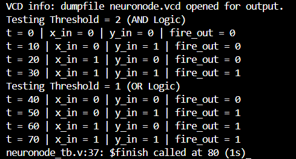

# 🧬 The McCulloch-Pitts Neuron - MCP Neuron
- Also known as a neuronode
- A simple computational model of a biological neuron
- `Biological neuron:`
   - receives inputs via its tree-like projections called dendrites
   - The cell body then performs computation on these inputs
   - Based on results of the computation, it may send an electrical signal through the axon toward axon-terminals which in turn communicate it to other neurons
   - This forms a biological neural network
- `MCP Neuron:`
   - Warren McCulloch and Walter Pitts proposed a simple logical model of a neuron
   - It sums the inputs say A and B where A,B ∈ {0,1}: M = A + B
   - It has a threshold θ, if:
      - M ≥ θ -> Neuron Fires, Output = 1
      - M < θ -> Neuron Doesn't Fires, Output = 0
   - Based on the value of θ, we can implement any logic gate like AND, OR
   - For AND gate θ = 2, so the neuron will only output 1 if both the inputs are 1. ( 1(A) + 1(B) ≥ 2(θ) ), similarly for OR gate θ = 1

  

  MCP Neuron Waveform Analysis

  

## 〰️ Waveform
- From 0 - 40 Seconds: Threshold(θ) is set to 10(2)
   - 0 - 10 seconds ->
     - x = 0, y = 0, Thus Sum = x + y = 0
     - Sum < Threshold, so Neuron Does not fire, thus outputs 0
    
  - 10 - 20 seconds ->
    - x = 0, y = 1, Thus Sum = x + y = 1
    - Sum < Threshold, so Neuron Does not fire, thus outputs 0
   
  - 20 - 30 seconds ->
    - x = 1, y = 0, Thus Sum = x + y = 1
    - Sum < Threshold, so Neuron Does not fire, thus outputs 0

   - 30 - 40 seconds ->
    - x = 1, y = 1, Thus Sum = x + y = 10(2)
    - Sum ≥ Threshold, so Neuron Does fire, thus outputs 1

- Therefore, by setting the threshold to 10 (2), it only fires when both of its inputs are 1, acting like an `AND Logic gate`
  

  

  Output Terminal ($monitor)

  

- From 40 - 80 Seconds: Threshold(θ) is set to 01(1)
   - 40 - 50 seconds ->
     - x = 0, y = 0, Thus Sum = x + y = 0
     - Sum < Threshold, so Neuron Does not fire, thus outputs 0
    
  - 50 - 60 seconds ->
    - x = 0, y = 1, Thus Sum = x + y = 1
    - Sum ≥ Threshold, so Neuron Does fire, thus outputs 1
   
  - 60 - 70 seconds ->
    - x = 1, y = 0, Thus Sum = x + y = 1
    - Sum ≥ Threshold, so Neuron Does fire, thus outputs 1

   - 70 - 80 seconds ->
    - x = 1, y = 1, Thus Sum = x + y = 10(2)
    - Sum ≥ Threshold, so Neuron Does fire, thus outputs 1

 - Therefore, by setting the threshold to 01 (1), it only fires when any or both of its inputs are 1, acting like an `OR Logic gate`
