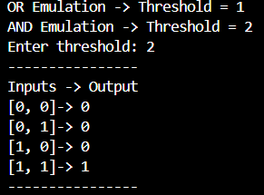

# 🧠 Artificial-Neuron
- This project implements a basic artificial neuron (McCulloch–Pitts model) using `Verilog HDL` and `Python`. The current version consists of a simple 2-input neuron node that sums binary inputs and produces an output based on  a programmable threshold. With different threshold values, the neuron can emulate basic logic functions such as AND and OR.

  

  MCP Neuron Waveform Analysis

  

<table align="center">
  <tr>
    <td align="center" style="padding-right: 50px;">
       
        MCP-Neuron AND-Emulation in Python
    </td>
    <td align="center" style="padding-left: 50px;">
       
       MCP-Neuron OR-Emulation in Python
    </td>
  </tr>
</table>

## 🛠️ Current Development
- [MCP-Neuron_v0](MCP-Neuron_v0): A 2-input computational model of a biological neuron capable of implementing basic boolean operations.

## 🚀 Future Versions
- Multiple Input MCP Neuron
- Adding weights to input
- Inhibitory weights

## 🤝 Similar Projects
- [Gate Level Perceptron](https://github.com/KARAN-D05/Gate-Level-Perceptron): Building a Self Learning Pattern Recognition engine to explore how learning is implemented in hardware.
