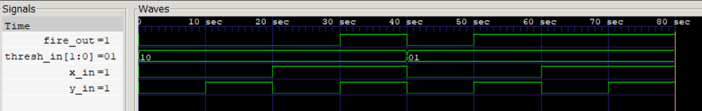
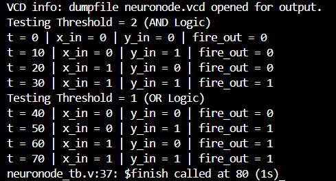

# 🧠 Artificial-Neuron
- This project implements a basic artificial neuron (McCulloch–Pitts model) using `Verilog HDL`. The current version consists of a simple 2-input neuron node that sums binary inputs and produces an output based on  a programmable threshold. With different threshold values, the neuron can emulate basic logic functions such as AND and OR.

  

  MCP Neuron Waveform Analysis

  

  

  Output Terminal

  

## 🛠️ Current Development
- [MCP-Neuron](MCP-Neuron): A 2-input computational model of a biological neuron capable of implementing basic boolean operations

## 🚀 Future Versions
- Multiple Input MCP Neuron
- Adding weights to input
- Inhibitory weights

## 🤝 Similar Projects
- [Gate Level Perceptron](https://github.com/KARAN-D05/Gate-Level-Perceptron): Building a Self Learning Pattern Recognition engine to explore how learning is implemented in hardware.
