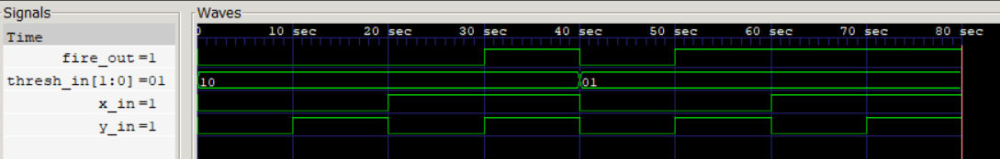
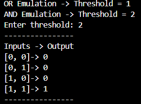
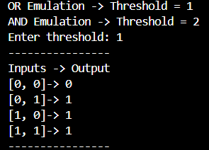
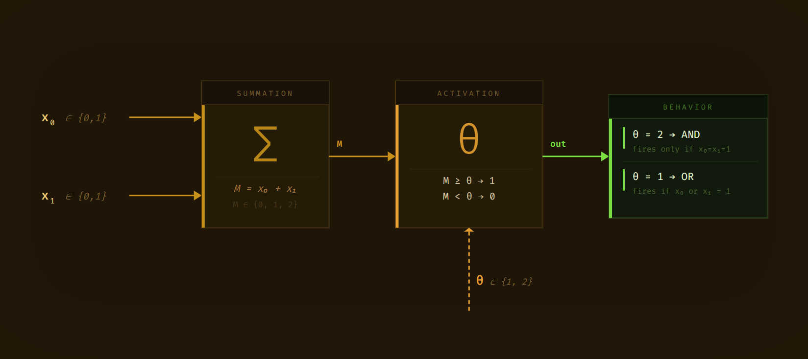

# 🧠 Artificial-Neuron
- This project implements a basic artificial neuron (McCulloch–Pitts model). The current version consists of a simple 2-input neuron node that sums binary inputs and produces an output based on  a programmable threshold. With different threshold values, the neuron can emulate basic logic functions such as AND and OR.

<p align="center">
  

<p align ="center">
  Waveform Analysis - Verilog
</p>  

<table align="center">
  <tr>
    <td align="center" style="padding-right: 50px;">
      <br>
          AND-Emulation - Python
    </td>
    <td align="center" style="padding-left: 50px;">
      <br>
          OR-Emulation - Python
    </td>
  </tr>
</table>

## ⚙️ Implementation Stack


## 🛠️ Current Development
- [MCP-Neuron_v0](MCP-Neuron_v0): A 2-input computational model of a biological neuron capable of implementing basic boolean operations.

<p align="center">
  

<p align ="center">
  
</p>  

## 🚀 Future Versions
- Multiple Input MCP Neuron
- Adding weights to input
- Inhibitory weights

## 🤝 Similar Projects
[Gate Level Perceptron](https://github.com/KARAN-D05/Gate-Level-Perceptron): Building a Self Learning Pattern Recognition engine to implement learning in hardware.

## ⬇️ Download This Repository

### 🪟 Windows
Download → [download_repos.bat](./download_repos.bat)
``` 
Double-click it and pick the repo(s) you want.
```

### 🐧 Linux / macOS
Download → [download_repos.sh](./download_repos.sh)
```
bash

chmod +x download_repos.sh
./download_repos.sh
```

> Always downloads the latest version.

## 🛠️ Toolchain & Repo Utilities - Built to make navigating and interacting with this repo easier

### 🔧 portmap - Verilog Port Extractor

`portmap` is a lightweight CLI tool that extracts port definitions (`input`, `output`, `inout`) from Verilog modules and presents them in a clean table or Markdown format.

#### 🔗 Source
https://github.com/KARAN-D05/portmap-HDL/blob/main/utils/portmap

#### 📦 Release (Download Binary)
https://github.com/KARAN-D05/portmap-HDL/releases/tag/v1.0.0

#### 🚀 Usage
```bash
portmap file.v
portmap file.v --md
```

### 🧰 Repo Filetree Generator
[Filetree](https://github.com/KARAN-D05/portmap-HDL/tree/main/utils) - A repository file tree generator that prints a visual directory tree with file-type icons and a file count breakdown by extension (`.v`, `.circ`, `.md`, `.py` and more).

  
**Utils (Portmap + Filetree)- Fetched automatically as a utils package alongside any repo download - includes portmap binaries, filetree, and source code via [download_repos.bat](download_repos.bat) / [download_repos.sh](download_repos.sh).**

## 📜 License
- Source code, HDL, and Logisim circuit files are licensed under the MIT License.
- Documentation, diagrams, images, and PDFs are licensed under Creative Commons Attribution 4.0 (CC BY 4.0).
