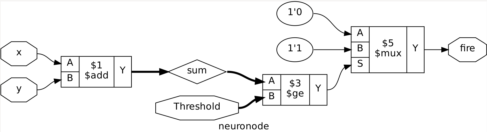
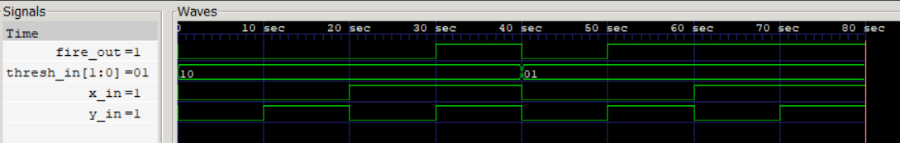
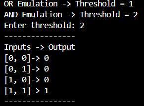
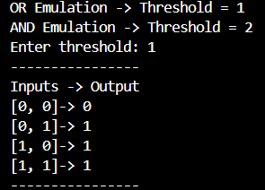
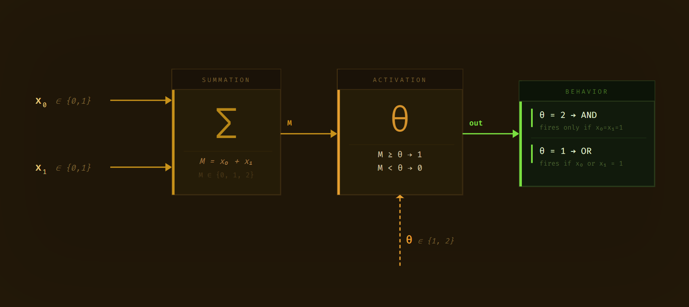

# 🧠 Artificial-Neuron
- A 2-input neuron node that sums binary inputs and produces an output based on a programmable threshold. With different threshold values, the neuron can emulate basic logic functions such as AND and OR, and With inhibitory weights, can emulate NOT logical function.

  
  </b> RTL Synthesis

  

  
  </b> Waveform Analysis - Verilog

  

<table align="center">
  <tr>
    <td align="center" style="padding-right: 50px;">
       
         </b> AND-Emulation - Python
    </td>
    <td align="center" style="padding-left: 50px;">
       
         </b> OR-Emulation - Python
    </td>
  </tr>
</table>

## 🛠️ Toolchain

## 🛠️ Current Development
- [MCP-Neuron_v0](MCP-Neuron_v0): A 2-input computational model of a neuron capable of implementing AND and OR Logic.
- [MCP-Neuron_v1](MCP-Neuron_v1): A 2-input computational model of a neuron with inhibitory weights capable of implementing NOT Logic.

  
 </b> MCP Neuron - AND and OR Emulation

  

## 🤝 Similar Projects
- [Adaptive Learning System](https://github.com/KARAN-D05/Gate-Level-Perceptron): Capable of autonomously altering its decision boundaries based on error feedback

## 📜 License
- Source code, HDL, and Logisim circuit files are licensed under the MIT License.
- Documentation, diagrams, images, and PDFs are licensed under Creative Commons Attribution 4.0 (CC BY 4.0).
